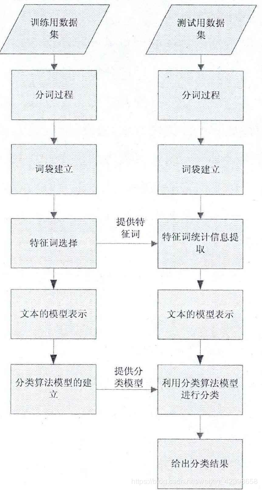
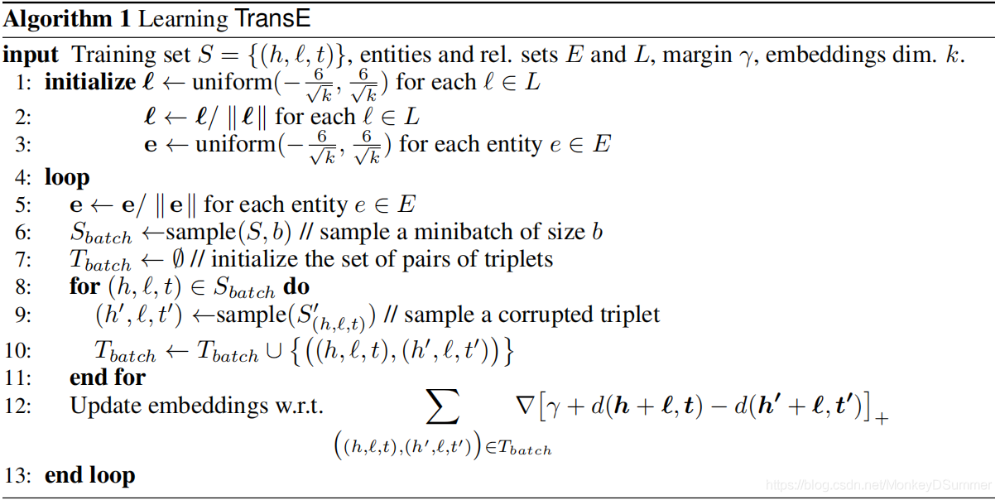
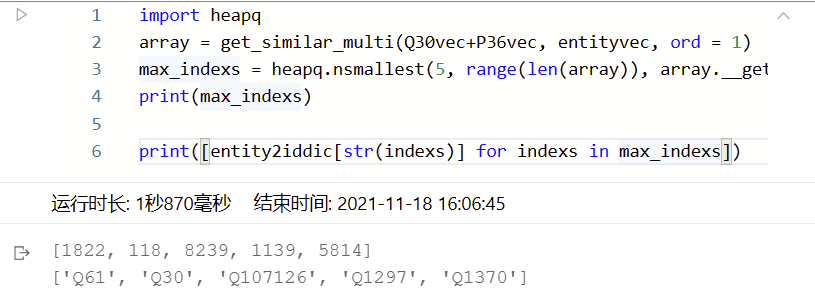

# 2048023 徐德轩 第四次选做作业 VSM介绍与TransE模型训练与分析

## 1. VSM向量空间模型

- **基本思想**：把对文本内容的处理简化为向量空间中的向量运算，并且它以空间上的相似度表达语义的相似度。
- **流程**：
- 对所有文档使用BOW进行分词，得到一个Dictionary。
- 使用TF-IDF方法，计算Dictionary里面每一个词的TF、IDF值，根据计算得到结果构造一个新的Dictionary
- 根据新Dictionary使用BOW对每个文档进行向量表示
- 根据余弦公式进行文档相似度计算。

## 2. TransE模型训练与分析
个人代码项目链接：[https://github.com/heavenbirdxdx/TransE](https://github.com/heavenbirdxdx/TransE)

### 2.1 TransE简介

- **提出背景**：TransE模型是一种对知识图谱实体与关系特征表示的经典算法，本质上是将知识图谱中实体、关系映射到向量空间中，进行知识表示。
- **核心思想**：TransE模型规定，头实体的Embedding加上关系的Embedding会等于尾实体的Embedding，同理一个错误的知识图谱三元组就不满足这种关系。
- **得分函数**：得分函数(score function)为
$$
f(h,r,t)=||h+r-t||
$$
其中$||\cdot||$​表示向量的范数。得分越小，表示该三元组越合理。
- **计算损失**：计算损失函数时，TransE采样一对正例和一对负例，并让正例的得分小于负例，优化下面的损失函数
$$
\mathcal{L}=\sum_{(h,r,t)\in\Delta,(h',r',t')\in\Delta'}\max\left( 0, [\gamma+f(h,r,t)-f(h',r',t')]\right)
$$
其中$(h,r,t), (h',r',t')$分别表示正例和负例，$\gamma$​是​一个超参数(margin)，用于控制正负例的距离。
- **算法描述**：论文中的算法描述：


### 2.2 TransE代码实现

- **数据集**：采用wikidata小型知识图谱数据集，包含50000种实体和378种关系。
- **得分函数**：输入h,t,r分别代表头实体、尾实体、关系，计算距离得分，p_norm代表计算采用的矩阵范数类型。
```python
def _calc(self, h, t, r):
    if self.norm_flag:
        h = F.normalize(h, p=2, dim=2)
        t = F.normalize(t, p=2, dim=2)
        r = F.normalize(r, p=2, dim=2)
        distance = h + r - t
        score = torch.norm(distance, p=self.p_norm, dim=2)
        return score
```
- **损失函数**：按照公式计算损失，pos_score和neg_score分别是一组正例和一组负例对应的距离得分。margin是超参数，控制正负得分函数之间的距离。
```python
def loss(self, pos_score, neg_score):
    zero_tensor =  torch.FloatTensor(pos_score.size()).cuda()
    zero_tensor.zero_().cuda()
    loss = torch.sum(torch.max(pos_score - neg_score + self.margin,zero_tensor))
    return loss
```
- **模型结构**：TransE模型非常简单，只由实体Embedding层和关系Embedding层组成，通过得分函数和损失函数不断优化Embedding的映射结果，将实体和关系映射到向量空间中。


### 2.3 测试结果

- 这里我们给定margin=1, p_norm=1, epoch=100, 编写测试代码，测试给定头实体Q30(United States of America)和关系P36(capital)，能否找到正确的尾实体Q61(Washington, D.C.)
- 测试过程和训练过程类似，我们首先读取训练好的实体和关系的Embedding向量，将它们进行归一化、计算距离范数，求出向量空间中最相似的实体。
- 测试结果如图所示，可以预测距离最小的n个实体，其中距离最近的为Q61实体。


## 参考资料

[1] https://www.jianshu.com/p/ff8e9b6d636a
[2] https://proceedings.neurips.cc/paper/2013/hash/1cecc7a77928ca8133fa24680a88d2f9-Abstract.html
[3] https://github.com/thunlp/OpenKE/tree/OpenKE-PyTorch/openke/module/model


